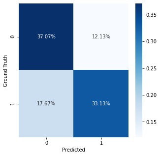

# Heart_Disease_Detection
Machine Learning approach to classifying patients with Heart Disease

## Dataset 
You can download the dataset from Kaggle using this [link](https://www.kaggle.com/sulianova/cardiovascular-disease-dataset/data).

## Overview

We are determining whether a patient is at risk of developing a cardiovascular problem using various parameters given to us.
I have used Random Forest Classifier as I found this to provide a better accuracy than the other models I employed.
Accuracy Achieved :-    70.2%

Feel free to change the code and use any other algorithm of your choice.

## Confusion Matrix

**Note:-** This model is in no way to be used for actually classifying patients, as the accuracy is not good enough for that.

Keep chasing your dreams ! ⭐️
